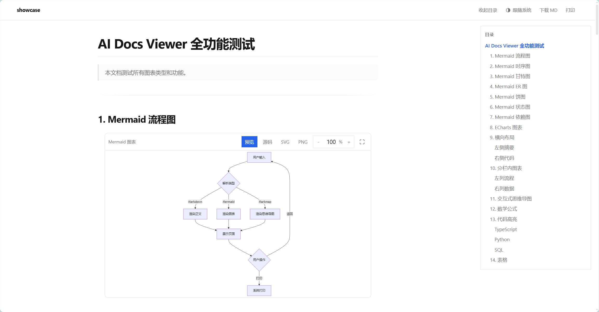
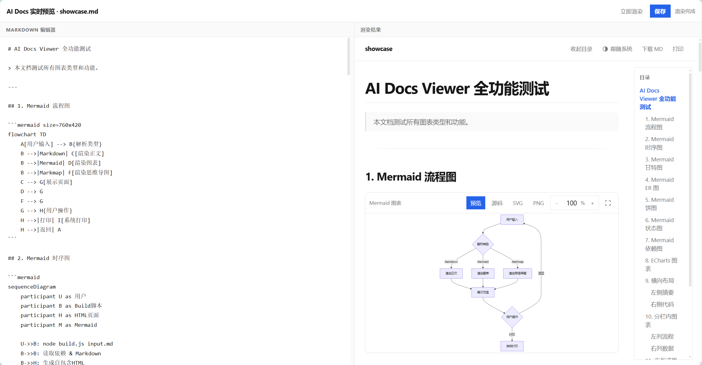
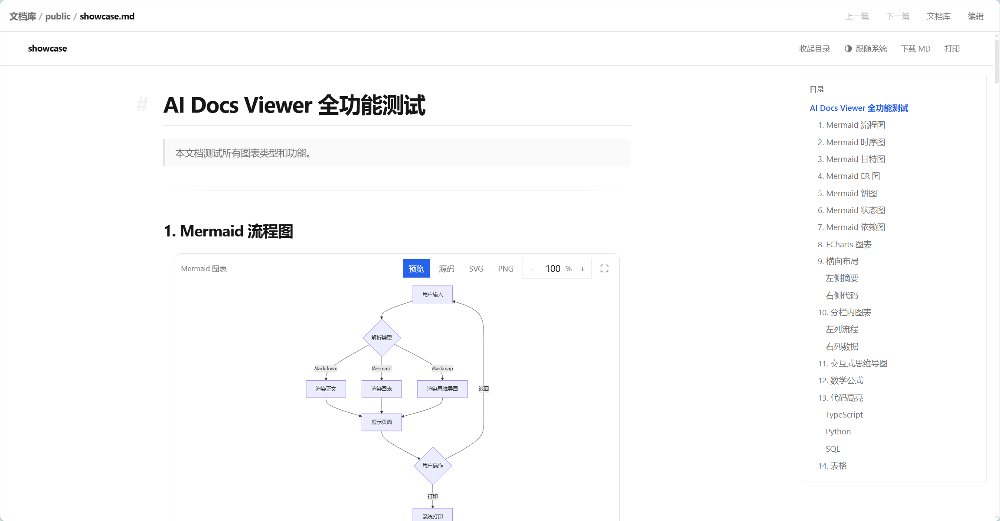
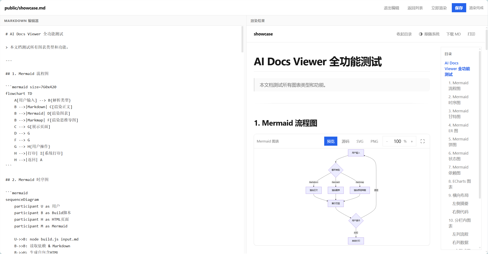

# AI Docs

> AI Docs 让 Agent 和命令行用户撰写、渲染、预览并可选择发布 Markdown 文档：Mermaid、ECharts、Markmap、KaTeX 与分栏排版，单文件离线 HTML 或 Web URL。

[](https://github.com/hymsk/ai-docs/actions/workflows/ci.yml)

[中文](README.cn.md) | [English](README.md) · [更新日志](CHANGELOG.md) · [安全策略](SECURITY.md) · [协作指南](CONTRIBUTING.md) · [Agent 协作规则](AGENTS.md)

当前公开兼容基线：`v1.0.0rc1`。自有代码使用 `AGPL-3.0-or-later`；内置浏览器资源遵循各自许可证，详见 [`THIRD_PARTY_NOTICES.md`](THIRD_PARTY_NOTICES.md)。

## 使用场景

- **Agent 写文档**：让 AI 把调研报告、架构设计、会议纪要渲染成带图表的 HTML；已配置 `ai-docs` MCP 时直接返回可分享的 Web URL，否则生成本地单文件。
- **本地排版与预览**：命令行把 Markdown 构建为离线单文件 HTML（无 CDN 依赖），或用左右分栏实时预览边写边看，打印即得 PDF。
- **团队文档库**：可选部署 Web 发布服务，`publish_document` 直写公开目录即上线，`/docs/` 实时渲染；常驻预览库提供受保护的在线阅读与编辑。

AI Docs 不自动发布任何内容：Web 发布服务只在用户明确要求后安装，`public/` 目录内容公网可读，写入前请确认不含机密。

## 安装

按使用方式选择；命令行用户可以跳过安装直接构建（见「使用」）。

| 方式 | 适用 | 需要做什么 |
| --- | --- | --- |
| [Agent Skill](#agent-skill) | 让 AI 按 Skill 工作流写文档 | 完整克隆到 Host 的 Skill 目录，目录名保持 `ai-docs` |
| [可选 Web 发布](#可选-web-发布) | 发布 URL、在线阅读与编辑 | 在 Agent Skill 基础上显式运行安装器（Linux + systemd） |

**一段可发给 AI 的安装 prompt：**

```text
克隆 https://github.com/hymsk/ai-docs.git 到我的 [Skill 目录，如 ~/.claude/skills/ai-docs]（目录名保持 ai-docs，保留本地修改），按照 README.cn.md「安装」一节为我的 [Agent Host，如 Claude Code] 完成安装并重启验证 ai-docs 可见；不要只复制 SKILL.md，不要自动安装或启动 Web MCP 服务，遇到缺失信息先问我。
```

### Agent Skill

```bash
mkdir -p "$HOME/.claude/skills"
git clone https://github.com/hymsk/ai-docs.git "$HOME/.claude/skills/ai-docs"
```

也可解压完整源码包；Codex、OpenCode 的发现路径以各 Host 文档为准。安装后重启或重新加载 Host。**不要只复制 `SKILL.md`**：必须携带 `scripts/`、`scripts/vendor/`、`references/`、`assets/`、`licenses/` 及根级许可证文件。

运行要求：Node.js 18+ 与 Python 3.9+（仅标准库），均无需安装依赖；Web MCP 安装器另需 Linux 与 systemd。Mermaid、Markmap、KaTeX 与打印效果需在现代浏览器中验证。

## 使用

### 构建单文件 HTML

```bash
node scripts/build.js --input document.md --output document.html
```

默认输出单文件，按内容内联依赖，未使用的图表与高亮资源不写入成品。多文件站点模式（`--output-mode multi`）把依赖写入可配置静态目录，适配 Nginx 子路径部署，见 [CLI 与配置](references/cli-and-config.md)。



### 本地实时预览

```bash
node scripts/preview.js --input document.md --open
```

左侧 Markdown 编辑器，右侧同一 renderer 的隔离预览，防抖自动刷新；`Ctrl/⌘ + S` 原子写回源文件，`Ctrl/⌘ + Enter` 立即渲染。默认只监听 `127.0.0.1:8000`；绑定非 loopback 地址时进程生成随机访问令牌（输出 URL 的 `?key=` 或 `Authorization: Bearer`），`/save` 拒绝未授权请求。也支持多文件目录浏览的静态服务器 `python3 scripts/serve.py --directory dist --port 8000`。



### 可选 Web 发布

Skill 同步不会自动安装 Web MCP。只有用户明确要求后才运行：

```bash
python3 <SKILL_DIR>/scripts/web-mcp-manager.py plan
python3 <SKILL_DIR>/scripts/web-mcp-manager.py install
python3 <SKILL_DIR>/scripts/web-mcp-manager.py start
```

默认用户级安装：Runtime 与数据在 `~/.local/share/ai-docs-web/`，配置与私有凭据（`0600`）在 `~/.config/ai-docs-web/`，user systemd 单元自动注册。外网 HTTPS、Nginx Auth 与公网 MCP 均需显式选择，完整安装与升级语义见 [Web MCP 安装指南](references/web-mcp-setup.md)。

安装后提供：

- **MCP 发布**：`publish_document` 把 Markdown 写入库中 `public/` 目录即完成发布，`/docs/` 按 URL 实时渲染（省略 `.md` 后缀，目录 `README.md` 即索引）。
- **常驻预览库**：`/preview/` 列出库内全部受管理 Markdown；浏览器登录页用 `Authorization: Bearer` 经 `POST /preview/session` 换 `HttpOnly` 会话 cookie，**不接受 `?token=`**，避免 Token 进入 URL 与历史。
- **阅读页** `/preview/view?path=...`：受保护的渲染阅读，标题可逐级跳转文档库目录，同目录上一篇/下一篇。
- **编辑器** `/preview/edit?path=...`：与本地预览一致的左右分栏编辑，保存受库配额约束，`preview.write_back: false` 时拒绝写回。





## MCP 工具速览

| 工具 | 用途 |
| --- | --- |
| `publish_document` | 把 Markdown 直写公开目录完成发布；默认拒绝覆盖，支持 `expected_sha256` 乐观并发；返回 `public_url` |
| `list_documents` | 按 `prefix` 与分页浏览公开目录中的文档 |

两个工具均要求 Bearer Token；发布成功不保证渲染无误（返回 `render_status: "not_checked"`），发布后用浏览器确认。参数与限制见 [CLI 与配置](references/cli-and-config.md)。

## 卸载

| 范围 | 操作 |
| --- | --- |
| Agent Skill | 从 Host 的 Skill 目录删除 `ai-docs/` 并重启 Host；不影响已生成的 HTML 与 Web 服务 |
| Web MCP 服务 | `python3 <SKILL_DIR>/scripts/web-mcp-manager.py uninstall`；文档库数据默认保留，确认不再需要后用 `--purge` 一并清理 |

卸载不会删除已生成的 HTML 成品、文档库数据或 Nginx/凭据等部署期手工配置，请确认后另行清理。

## 安全边界

- **内置资源离线可用**：脚本/样式不依赖 CDN，资源清单拒绝远程 URL；但 Markdown 图片可引用远端，打开独立 HTML 可能联网。
- **`public/` 不是私密区**：内容无需 Token 即可读取，路径可预测、可能被搜索引擎收录，不要存放机密。
- **Token 不出现在 URL**：Web API 与 MCP 默认要求 Bearer Token；预览登录经 POST 换取会话 cookie；Token 只保存在私有凭据文件，不传给 renderer。
- 完整边界见 [`SECURITY.md`](SECURITY.md) 与 [安全与限制](references/safety-and-limitations.md)。

## 功能速览

Markdown、表格、代码高亮与复制、折叠；Mermaid 各类图、ECharts 静态数据图、Markmap 思维导图、KaTeX 公式；2-4 列分栏、目录、亮暗主题、图表缩放与 SVG/PNG 导出、浏览器原生打印；ECharts 构建期严格校验。编写方法见 [创作指南](references/authoring-guide.md) 与 [组件目录](references/components/index.json)。

ECharts 当前是静态 SSR（无 tooltip/点击交互）；PDF 由浏览器打印生成。不内置 Graphviz，`dot`/`graphviz` fence 会降级为普通代码块（表头带警示标识，悬浮显示原因）而不让构建失败，请迁移为 Mermaid flowchart。

## 文档

- [CLI 与 JSON 配置](references/cli-and-config.md)
- [创作指南](references/authoring-guide.md)
- [安全与限制](references/safety-and-limitations.md)
- [Web MCP 安装](references/web-mcp-setup.md) · [HTTPS 与外网访问](references/web-mcp-external-access.md)
- [文档生成 Agent 方法论](references/agent-design/00-方法论总览.md) · [Agent 工作流](SKILL.md)

## 维护与许可

修改渲染器、vendor、示例或组件文档时只修改本仓库；vendor 更新必须同步 [`THIRD_PARTY_NOTICES.md`](THIRD_PARTY_NOTICES.md)。完整质量门命令与协作规范见 [`CONTRIBUTING.md`](CONTRIBUTING.md)。

[AGPL-3.0-or-later](LICENSE)；内置浏览器资源遵循各自许可证，见 [`THIRD_PARTY_NOTICES.md`](THIRD_PARTY_NOTICES.md)。
