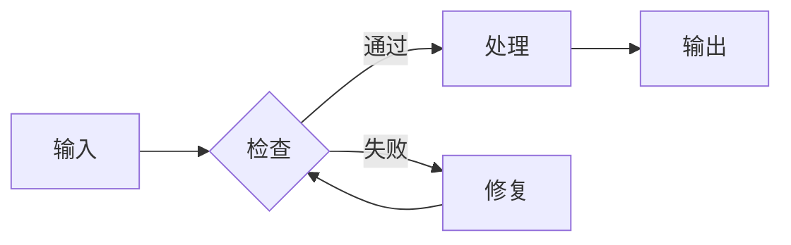

# 文档标题

> 用一句话说明本文档的目的或核心结论。

## 摘要

- 关键结论一
- 关键结论二
- 关键结论三

## 背景与范围

说明读者、业务或技术背景、覆盖范围、数据时间和不包含的内容。

## 核心流程

下面的流程图说明主要步骤和分支。



## 关键数据

下面的数据图需要替换为真实、可核对的数据。

```echarts size=760x420
{
  "title": { "text": "指标趋势", "left": "center" },
  "xAxis": { "type": "category", "data": ["阶段一", "阶段二", "阶段三"] },
  "yAxis": { "type": "value", "name": "单位" },
  "series": [
    { "name": "指标", "type": "line", "data": [12, 18, 24] }
  ]
}
```

## 风险与限制

| 风险 | 影响 | 缓解措施 |
| --- | --- | --- |
| 待补充 | 待补充 | 待补充 |

## 后续动作

1. 待办事项一。
2. 待办事项二。
