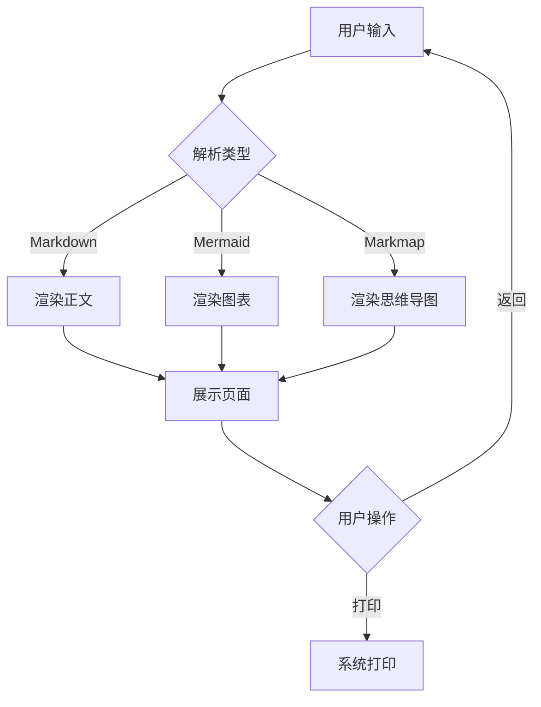
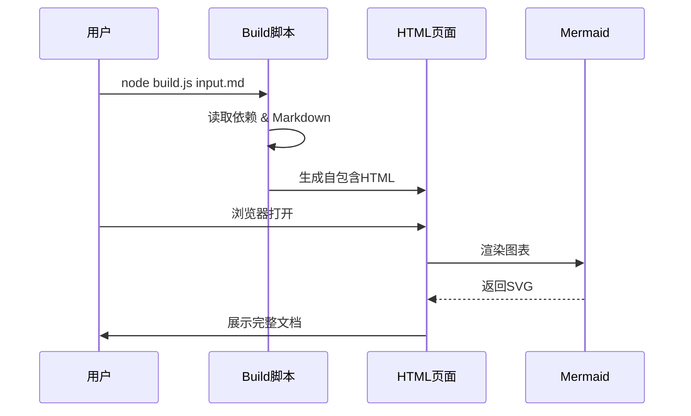
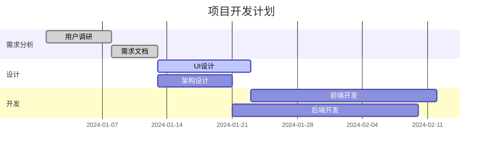
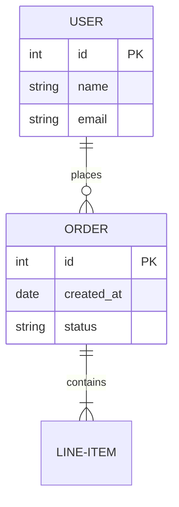
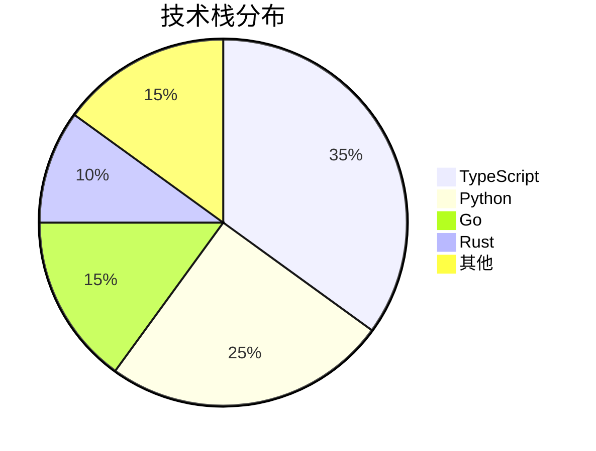
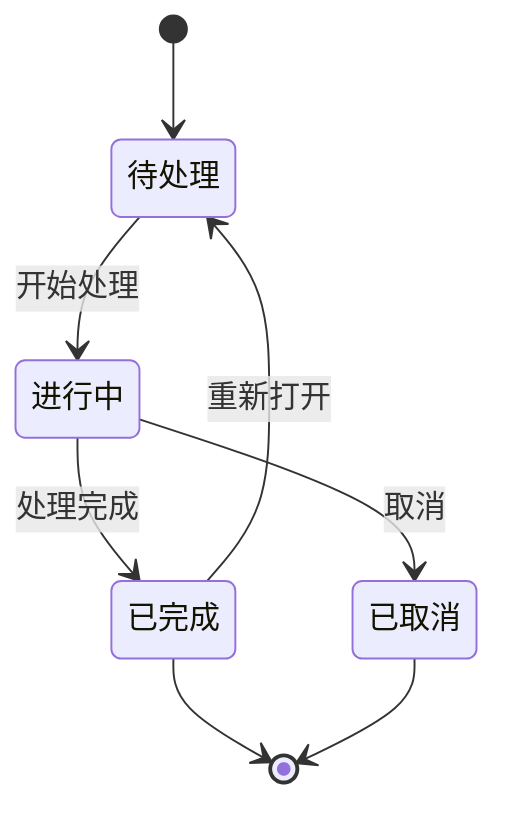
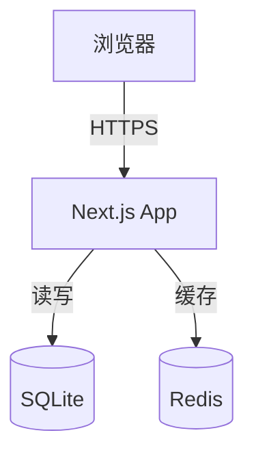
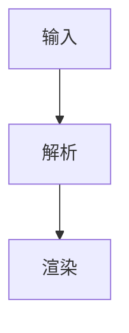

# AI Docs Viewer 全功能测试

> 本文档测试所有图表类型和功能。

---

## 1. Mermaid 流程图



## 2. Mermaid 时序图



## 3. Mermaid 甘特图



## 4. Mermaid ER 图



## 5. Mermaid 饼图



## 6. Mermaid 状态图



## 7. Mermaid 依赖图



## 8. ECharts 图表

```echarts
{
  "title": { "text": "技术栈分布", "left": "center" },
  "tooltip": { "trigger": "item" },
  "legend": { "orient": "vertical", "left": "left" },
  "series": [
    {
      "name": "语言",
      "type": "pie",
      "radius": "50%",
      "data": [
        { "value": 35, "name": "TypeScript" },
        { "value": 25, "name": "Python" },
        { "value": 15, "name": "Go" },
        { "value": 10, "name": "Rust" },
        { "value": 15, "name": "其他" }
      ],
      "emphasis": {
        "itemStyle": { "shadowBlur": 10, "shadowOffsetX": 0, "shadowColor": "rgba(0,0,0,0.5)" }
      }
    }
  ]
}
```

## 9. 横向布局

::: columns
::: column
### 左侧摘要

- 正文宽度可配置为 50%–100%
- 适合并列展示说明与实现

:::
::: column
### 右侧代码

```javascript
const contentWidth = 80;
console.log(`${contentWidth}%`);
```
:::
:::

## 10. 分栏内图表

::: columns
::: column
### 左列流程




:::
::: column
### 右列数据

```echarts size=640x360
{
  "title": { "text": "列内趋势", "left": "center" },
  "xAxis": { "type": "category", "data": ["一", "二", "三"] },
  "yAxis": { "type": "value" },
  "series": [{ "type": "line", "data": [12, 19, 16] }]
}
```

```markmap size=640x360
# 列内导图
## 预览
## 导出
```
:::
:::

## 11. 交互式思维导图

```markmap
# AI Docs Viewer
## 核心功能
### Markdown 渲染
### Mermaid 图表
- 流程图 / 时序图 / 甘特图
- ER图 / 饼图 / 状态图
### Mermaid 关系图
- 依赖图 / 网络拓扑
### ECharts
- 数据可视化
### 交互思维导图
### 数学公式
### 代码高亮
## 特性
### 完全离线
### 暗色主题
### 响应式布局
### 打印导出
```

## 12. 数学公式

行内公式：质能方程 $E = mc^2$，欧拉公式 $e^{i\pi} + 1 = 0$。

二次方程求根公式：

$$x = \frac{-b \pm \sqrt{b^2 - 4ac}}{2a}$$

矩阵：

$$\begin{pmatrix} a & b \\ c & d \end{pmatrix} \begin{pmatrix} x \\ y \end{pmatrix} = \begin{pmatrix} ax + by \\ cx + dy \end{pmatrix}$$

积分：

$$\int_0^\infty e^{-x^2} dx = \frac{\sqrt{\pi}}{2}$$

求和：

$$\sum_{n=1}^{\infty} \frac{1}{n^2} = \frac{\pi^2}{6}$$

## 13. 代码高亮

### TypeScript

```typescript
interface Config {
  theme: 'light' | 'dark';
}

function init(config: Config): void {
  console.log(`Theme: ${config.theme}`);
}
```

### Python

```python
from dataclasses import dataclass

@dataclass
class Document:
    title: str
    content: str

    def render(self) -> str:
        return f"<h1>{self.title}</h1>"
```

### SQL

```sql
SELECT u.name, COUNT(o.id) AS order_count
FROM users u
LEFT JOIN orders o ON o.user_id = u.id
GROUP BY u.id
ORDER BY order_count DESC;
```

## 14. 表格

| 图表类型 | 引擎 | 代码块 | 离线 |
|---------|------|--------|------|
| 流程图/时序图/甘特图/ER图/饼图/状态图 | Mermaid | `mermaid` | ✅ |
| 依赖图/网络拓扑 | Mermaid | `mermaid` | ✅ |
| 数据图表 | ECharts | `echarts` | ✅ |
| 交互思维导图 | Markmap | `markmap` | ✅ |
| 数学公式 | KaTeX | `$...$` / `$$...$$` | ✅ |
| 代码高亮 | highlight.js | 语言名 | ✅ |

---

> 所有功能完全离线可用，无外部依赖。
