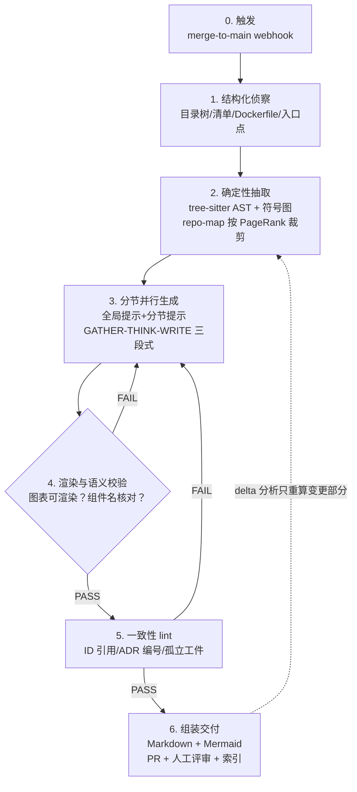

# 调研报告 05 · 架构设计方向：如何开发 Agent 更好地生成架构设计文档

> **系列**：文档生成 Agent 多方向调研（总览见 [README](./README.md)）
> **本篇方向**：如何开发（或配置）AI Agent，使其高质量地生成**架构设计文档**
> **调研日期**：2026-08-22
> **信息来源**：学术论文（arXiv / ACL：CIAO、ArchView、DocAgent 等）、开源 Agent Skill 生态、工程实践博客、中文社区最佳实践
> **姊妹篇**：[04 代码解释](./04-代码解释方向.md)（与本篇共享 AST/拓扑序技术栈）｜ [01 交互设计](./01-交互设计方向.md) ｜ [02 需求文档](./02-需求文档方向.md)

---

## 目录

1. [核心结论速览](#1-核心结论速览)
2. [问题定义：直接让 Agent 写架构文档为什么会失败](#2-问题定义)
3. [目标产物体系：先定义"好文档"](#3-目标产物体系)
4. [十大设计原则](#4-十大设计原则)
5. [参考 Agent 工作流架构](#5-参考-agent-工作流架构)
6. [提示工程要点](#6-提示工程要点)
7. [图表生成最佳实践](#7-图表生成最佳实践)
8. [防幻觉与证据机制](#8-防幻觉与证据机制)
9. [增量更新与防漂移机制](#9-增量更新与防漂移机制)
10. [质量评估框架](#10-质量评估框架)
11. [开源生态盘点](#11-开源生态盘点)
12. [反模式清单](#12-反模式清单)
13. [落地路线建议](#13-落地路线建议)
14. [与系列其他报告的互鉴](#14-与系列其他报告的互鉴)
15. [参考资料](#15-参考资料)

---

## 1. 核心结论速览

| # | 结论 | 依据 |
|---|------|------|
| 1 | **模板驱动 > 自由发挥**。用 ISO/IEC/IEEE 42010、C4、arc42 等标准模板约束生成结构，开发者普遍认可其产出"有价值、可理解、基本准确" | CIAO 论文（22 名开发者实测） |
| 2 | **专业领域 Agent 显著优于通用 Agent**。自定义架构 Agent 清晰度失败率 22.6%，通用 Agent 失败率 71.8%，裸提示词 31% | ArchView 实证研究（340 个仓库 / 4137 张视图） |
| 3 | **粒度错配是最大短板**：Agent 倾向于在代码级别罗列组件，而非做架构级抽象。必须通过关注点规格（concern specification）显式注入抽象层级要求 | 同上 |
| 4 | **先确定性抽取、后 LLM 综合**。用 tree-sitter/AST/启发式先把结构提出来，再让 LLM 做"综合解释"，比把整个仓库塞进上下文又便宜又准 | Angel Kurten 实践、Aider repo map |
| 5 | **分节并行生成**优于一次性生成整篇大文档（任务分解式提示策略） | CIAO、OpenDeepWiki |
| 6 | **依赖优先的拓扑排序**构建增量上下文，可同时提升文档的有用性与真实性（存在率 94.6% vs 随机顺序 86.8%） | DocAgent（ACL Demo） |
| 7 | **文件系统是记忆，不是对话**。每阶段落盘带证据标签的中间产物，阶段之间设验证门（FAIL 即停止），跨会话可恢复 | CodeCartographer、SLUMP/ProjectGuard |
| 8 | **事实与推断必须分离**。每条论断标注 observed fact / inference / open question，代码不足时主动提问而不是编造 | c4-codebase-architecture-skill 等 |
| 9 | **生成只是开始，防漂移才是长期价值**。Webhook 触发 + delta 分析 + CI 漂移门禁，把"文档过期"变成和测试失败同级的问题 | maat / drift / autodocs 等 |
| 10 | **人机协作定位：AI 提案，人类决策**。当前技术下 Agent 是辅助工具而非自主架构师；部署视图、高层上下文建模仍需人工把关 | ArchView 研究 + CIAO 评估局限 |

---

## 2. 问题定义

### 2.1 典型失败模式（学术实证）

对 340 个开源仓库、13 种实验配置、共 4137 张生成视图的实证研究（arXiv:2603.21178）发现：

1. **句法正确 ≠ 架构正确**。LLM 生成的视图几乎都能通过语法校验（错误率 <11%），但在完整性与一致性上表现差——结构上"像"，信息上"缺"。
2. **粒度错配（granularity mismatch）**：最顽固的问题。通用编码 Agent（如 Claude Code 直接上手）倾向于生成代码级别的组件堆砌，无法上升到架构抽象层级。
3. **性能排序**：裸 LLM 提示 < Few-shot（清晰度失败率降 9.2%）< 通用 Agent < **注入了领域知识、关注点规格与 ISO 42010 视图描述的自定义 Agent（ArchView）**。
4. **视图类型差异大**：控制流/数据流类视图可靠度高；需要深层变异性推理的部署视图、性能视图最难。
5. CIAO 的 22 名开发者评审同样指出三大短板：**图表质量、高层上下文建模（System Context）、部署视图**。

### 2.2 工程侧常见痛点

| 痛点 | 表现 |
|------|------|
| 幻觉 | 编造仓库中不存在的服务、接口、调用关系 |
| 过度自信 | 不区分"从代码确认的事实"与"猜测"，读者无从审校 |
| 一次性产物 | 生成即巅峰，两周后与代码脱节（documentation decay） |
| 上下文超限 | 中大型仓库塞不进窗口，模型"失忆"前三章 |
| 图表不可用 | Mermaid/PlantUML 渲染失败、元素过多布局爆炸、GitHub 上显示为乱码源码 |
| 成本失控 | 全量重新生成而非增量更新 |

---

## 3. 目标产物体系

调研中反复收敛到一套被广泛验证的**架构文档三件套**（README 讲"是什么"、C4 讲"长什么样"、ADR 讲"为什么"），三者互相引用：

```
docs/
├── ARCHITECTURE.md          # 或 README：1-2 页系统概述，新人入口
├── architecture/
│   ├── c4-context.md        # Level 1 系统上下文（必画）
│   ├── c4-container.md      # Level 2 容器视图（必画）
│   ├── c4-component-{x}.md  # Level 3 组件视图（按需，有增量价值才画）
│   └── c4-deployment.md     # 部署视图（生产系统才画）
├── adr/
│   ├── 0001-选择Kafka作为消息队列.md
│   └── ...
└── arc42/                   # 大型系统可选：arc42 12 章节完整模板
```

### 关键要点

- **C4 分层与受众映射**：
  | 层级 | 受众 | 建议 |
  |------|------|------|
  | L1 Context | 所有人 | 必画，对齐系统边界 |
  | L2 Container | 技术/产品 | 必画，多数团队到此即可 |
  | L3 Component | 开发者 | 有价值才画 |
  | L4 Code | — | 交给 IDE 自动生成，不要手写 |
- **arc42 的用法**：12 章节模板保证不遗漏维度（约束、上下文、构建块、运行时、部署、横切概念、决策、质量、风险、术语表）；实践中常"LEAN/ESSENTIAL/THOROUGH"三档裁剪，不必全写。
- **ADR 纪律**：
  - 五段式：标题 / 状态（提议→已接受→已弃用→已替代）/ 上下文 / 决策 / 后果；
  - **粒度按可逆性定，不按大小定**——难回退的决策（gRPC vs HTTP、Kafka 选型）写 ADR，换日志库这种不用写；
  - 已接受的 ADR 不可改，只能被新 ADR 取代（保留决策历史）；
  - 500 字以内说清楚，详细分析放 arc42 并互相链接。
- **图即代码（Diagram-as-code）**：图的源文件（Mermaid/PlantUML/Structurizr DSL）与代码同仓、同版本管理、走同一套 diff/review 流程。二进制绘图文件（draw.io/PNG）无法 diff，是反模式。

---

## 4. 十大设计原则

以下原则综合自学术论文与多个经过实战的开源 Agent Skill，可直接作为你开发"架构文档生成 Agent"的设计规范。

### P1 证据优先，事实与推断分离

每条论断打标签：`observed fact`（代码里看到的）/ `strong inference`（强推断）/ `portability hazard` / `open question`。输出风格要求"具体、可溯源到仓库证据、显式标注不确定度"。代码证据不足时，**正确的行为是列出缺失信息并向用户提问**，而不是编造。（来源：c4-codebase-architecture-skill、ai-craftkit、CodeCartographer）

### P2 模板与标准对齐

用结构化模板（C4 视图集 / arc42 章节 / MADR 格式的 ADR）约束每一节的产出结构与格式。CIAO 的实证表明：标准导向的模板能有效引导 LLM 产出可用且低成本的系统级架构文档。同时提供 few-shot 骨架示例（小型 Markdown/PlantUML 样例）作为格式脚手架。

### P3 先确定性抽取，后 LLM 综合

两阶段混合架构：
1. **确定性、零成本的结构抽取**：扫描目录树、依赖清单（package.json/pom.xml/go.mod）、Dockerfile/K8s 描述符、入口点、tree-sitter AST 提取符号声明与 import 关系；
2. **LLM 只负责"综合解释"**：拿到精选后的结构化摘要与关键文件内容，产出叙述性文档。

> 经验数据：全量投喂仓库反而更差（无关代码淹没信号）；混合抽取在成本与质量上双优。Aider 用 tree-sitter 符号图 + 个性化 PageRank 排序，再二分搜索适配 token 预算（默认约 1K tokens 的 repo map），确定性可复现、可 dump 调试。

### P4 任务分解，分节并行生成

不要让一次调用生成整篇文档。每个章节独立构造提示（全局提示 + 分节专属提示），并行提交，最后组装。这符合任务分解式提示策略的实证结论，也让失败可以局部重试。（CIAO、CodeArchDoc 只用 5 次请求覆盖全部文档类型的做法值得借鉴）

### P5 专业子代理分工

多智能体不是噱头，而是有实证收益的模式：
- DocAgent：Reader / Searcher / Writer / Verifier / Orchestrator 五角色协作；
- techdebtgpt/architecture-doc-generator：11 个专职分析器（文件结构、依赖、模式、数据流、Schema、安全、错误处理、数据契约、技术债、KPI、架构综合）；
- OpenDeepWiki：目录规划与内容写作可绑定不同模型（结构推理用强推理模型，正文写作用强写作模型）。

### P6 依赖优先的拓扑处理

按模块依赖关系拓扑排序后再逐个生成文档：被依赖者先生成，其文档成为依赖者的上下文。DocAgent 消融实验证明该顺序显著提升 Helpfulness 与 Truthfulness（实体存在率 94.64% vs 随机序 86.75%）。

### P7 文件系统即记忆 + 阶段门控

- 每个阶段的产出写入带模板的中间工件（如 `.findings/architecture/`、`status.yaml`），后续阶段按需重读特定上游文件，而非依赖对话历史；上下文压缩/新会话后可无损恢复；
- 阶段之间设**完成判据**，校验 FAIL 则流水线停止——绝不允许在幻觉架构之上继续盖楼；
- SLUMP 基准研究佐证：给长程 Agent 加一层外部项目状态跟踪（ProjectGuard），可挽回 90% 的忠实度损失。

### P8 渐进式披露的 Skill 设计

Skill 入口文件保持精简（~600 词 / ~80 行），方法论细节放 `references/`、输出格式放 `templates/`，按需加载。保持上下文窗口留给真正的代码阅读。（codebase-knowledge-builder 的四阶段结构：侦察 → 深读 → 工件撰写 → 交付）

### P9 生成-验证-修复闭环

- 图表：渲染校验（语法能否编译）+ 语义交叉核对（正则提取图中组件名，与输入描述/仓库实体比对，缺失则自动生成修正提示再迭代）；
- 文档间一致性 lint：ID 引用了却未定义、ADR 编号断档、"已被 ADR-XXXX 取代"悬空引用、孤立图表文件、不可量化的质量目标（enterprise-architecture-skill 的 ea_lint.py 思路）；
- 机械性错误自动修复，语义性漂移只标记交人工。

### P10 人机协作：AI 提案，人类决策

成熟团队的工作流是「**AI 提案 → 架构师评审 → 团队讨论 → 形成 ADR**」。AI 不知道组织政治、团队技能储备、隐性历史决策——这些恰恰影响架构取舍，因此终审权必须在人。生成的文档以 PR 形式交付、走正常 code review。

---

## 5. 参考 Agent 工作流架构

综合各开源实现，推荐如下六阶段流水线：



### 各阶段要点

| 阶段 | 输入 | 输出 | 关键机制 |
|------|------|------|----------|
| 0 触发 | push/merge 事件 | 任务 | HMAC 校验、去重（commit 未处理过才触发）；**webhook 优于 cron**（文档永远跟随最新代码） |
| 1 侦察 | 仓库 | 结构摘要 | 保留 Dockerfile/k8s/依赖清单等"配置工件"；剔除注释、测试数据、二进制（REPOMIX 式扁平化思路） |
| 2 抽取 | 结构摘要 | repo map + 关键文件集 | 符号图 + PageRank 排序，token 预算内二分拟合；缓存 AST 结果 |
| 3 生成 | repo map | 分节草稿 | 并行；强制三段式：**GATHER（必须用工具读码，禁止编造）→ THINK（深度分析）→ WRITE（所有代码块必须标注源文件出处）** |
| 4 校验 | 草稿 | 通过/修正提示 | PlantUML/Mermaid 语法检查器；组件名正则回捞比对；失败自动带反馈重试 |
| 5 lint | 全部草稿 | 报告 | 跨工件一致性检查（见 P9） |
| 6 交付 | 最终文档 | PR | 人工评审合并；同时写入向量库供 RAG 检索 |

### 增量策略（贯穿全程）

用 Git hash / 内容哈希缓存每个已分析文件的指纹，下次运行**只把变更文件送入 LLM**（delta analysis），实测可节省 60–90% 成本；支持对比任意基线分支，只生成"变更增强型"文档。

---

## 6. 提示工程要点

来自 CIAO 等论文与 OpenDeepWiki 生产实践的清单：

**全局提示（所有章节共享）**
- 角色：设定为"Meticulous Software Architect"（严谨的软件架构师），稳定语气与术语一致性；
- 受众与文风：明确写给谁看（新入职工程师 / 架构评审委员会）；
- 接地要求：**只允许基于提供的仓库内容生成，明确禁止发明仓库中不存在的架构元素**；
- 输出语言与格式约束（Markdown 结构 / Mermaid 语法限制）。

**分节提示（每章节独立）**
- 从模板实例化，说明本节的目标与预期产物（例如 Container 图一节：元素数 ≤20、箭头必须带协议标签）;
- 附少量 few-shot 骨架示例（小段 Markdown / PlantUML），仅作格式脚手架，防止内容照抄。

**执行纪律（GATHER-THINK-WRITE）**
- GATHER：强制先用 Read/Grep 工具取证，禁止凭空写代码片段；
- THINK：显式的分析整理阶段（支持原生 thinking 的模型开启之）；
- WRITE：所有代码块、路径引用**必须携带源文件归属**，便于人工抽查与后续自动化核验。

**其他实证技巧**
- Few-shot 对小模型/代码专用模型提升尤其明显（均值提升 + 方差下降）；
- 让 LLM 输出结构化中间表示（XML/JSON）时，解析器要带 regex 回退，容忍格式瑕疵（deepwiki-open 的健壮性设计）;
- 长文档用工具化增量写入（WriteDoc/AppendDoc），绕开单次响应 token 上限。

---

## 7. 图表生成最佳实践

### 7.1 格式选型

| 格式 | 上手成本 | 版本管理 | 适用 | 注意事项 |
|------|---------|---------|------|----------|
| Mermaid（flowchart 语法） | 低 | Git 原生 | GitHub/GitLab 内联展示、日常维护 | **GitHub 不内置 C4 插件**，勿用 `C4Context` 等语法 |
| PlantUML + C4 | 中 | Git 原生 | 需要 Java 环境、已有 PlantUML 团队 | 语法表达力强，需本地/CI 渲染 |
| Structurizr DSL | 中高 | Git 原生 | 长生命周期项目的"模型唯一真相源" | 一个 DSL 文件派生全部 C4 视图，天然保证跨图一致；Lite 可本地预览 |

> 小团队（单体/L1+L2）：Mermaid flowchart + ADR 即可；微服务中型团队：Structurizr DSL + ADR + CI；大型组织：再加 arc42 + 自动化验证。

### 7.2 GitHub 渲染约束（高频踩坑）

GitHub 的 Mermaid 渲染器**不打包 C4 插件**，`C4Context/C4Container/C4Component` 会显示为原始代码。 workaround 是转成标准 flowchart 语法：

| C4 语法 | Flowchart 替代 |
|---------|---------------|
| `Person()` / `System()` | `[矩形节点]` |
| `System_Boundary{}` / `Container_Boundary{}` | `subgraph ... end` |
| `Db()` | `[(圆柱形)]` |
| `Rel(a,b,"label")` | `a -- label --> b` |
| `UpdateLayoutConfig()` | 删除，用 `flowchart LR/TB` 控制 |

### 7.3 图表质量规则（写进 Skill）

1. 每张图 **≤20 个元素**，超了就拆图；
2. 每个元素四要素齐全：名称、类型、技术栈、一句话描述（描述尽量 <50 字符）;
3. **只用单向箭头**，双向箭头制造歧义；
4. 箭头必须带动词短语标签（"读取订单 using JDBC"，而不是光秃秃的 uses），附协议标签（JSON/HTTPS、gRPC）;
5. 别名语义化（`orderService` 而非 `s1`）；
6. 一图一抽象层级、一图一个主题；
7. 富视觉词汇（图标/形状/着色）比纯框线图的还原度更高（SSIM 提升 38–67%，实证）；
8. 生成后必须过一遍渲染校验再交付。

---

## 8. 防幻觉与证据机制

1. **证据分级标签**（写进模板 frontmatter 或行内标注）：
   ```
   <!-- evidence: observed-fact | src/services/order.ts -->
   <!-- evidence: inference | 由 package.json 依赖推断 -->
   <!-- evidence: open-question | 未找到消费者，待确认 -->
   ```
2. **主动追问**：代码证据不足以支撑某节时，Skill 应输出"定向问题清单"请用户补充，而非臆测填充；
3. **Claims 注册表**：把文档中的可验证论断抽成结构化清单（claim → 源文件 → 状态），代码变更时自动置 stale；机械性变化（改名/挪路径）自动修复，语义性变化加 `review-needed` 注释等人处理（ai-agentdoc 模式）;
4. **多层验证管道**（autodocs 的 FIND/REPLACE 方案，可直接借鉴到"文档修订建议"场景）：
   - LLM 生成结构化的查找/替换补丁；
   - 确定性代码校验 FIND 块确实存在于目标文档；
   - 再校验 REPLACE 中的标识符在源码中真实存在 → `EVIDENCED`（可自动应用）/ `MISMATCH`（拦截）/ `UNVERIFIED`(标记人工);
   - 只有"高置信 + 双重验证通过"的建议才允许自动开 PR。
5. **存在率审计**（DocAgent Truthfulness 思路）：从文档中抽取提及的仓库实体，逐一对照 ground truth 依赖表验证是否存在，量化幻觉率。

---

## 9. 增量更新与防漂移机制

> 核心思想：**把"文档与代码同步"从纪律问题变成工程问题**——ETH Zurich 对 138 个仓库、5694 个 Agent PR 的研究发现，写在指令文件里的规则经常被无视，而程序化检查才真正有效。

### 9.1 触发机制

| 机制 | 评价 |
|------|------|
| merge-to-main Webhook | ✅ 推荐。文档结构性永不过期，几分钟内刷新 |
| pre-commit hook | 适合轻量场景（CodeArchDoc 提供） |
| 定时 cron | ❌ 浪费资源且两次运行间必然过期 |

### 9.2 漂移检测的三种确定性手段

1. **Git 年龄差**：`git log/blame` 比较文档与其引用代码的最后修改时间差；
2. **TTL 契约**：文档 frontmatter 自报保质期（如 `ttl_days: 365`），过期扣分；
3. **符号级锚点**（最强）：文档绑定具体文件甚至 AST 符号（`src/auth/provider.ts#AuthConfig`），用 tree-sitter 归一化 AST 指纹（如 XxHash3）做签名——**重排版不会误报**，只有真改动才触发 stale（fiberplane/drift 方案）。`drift check` 在 CI 里退出码 1 即阻断合入。

### 9.3 新鲜度评分（Freshness Score）

将上述信号合成 0–100 的确定性分数，配合分层门禁：
- **PR 门禁**：单页分数骤降超过阈值（如 -4 分）→ 请作者顺手更新受影响页面；
- **趋势 SLI**：滚动 7 天中位数 ≥75，跌破进入"冻结文档类合入"预算；
- **关键页硬门槛**：标记 `critical: true` 的架构总览页单独设下限；
- 灰色地带（分数 35–65，符号还在但行为可能变了）交给 LLM 做语义复核，输出 STILL_ACCURATE / DRIFTED / NEEDS_HUMAN_REVIEW——注意 LLM 层设为软信号，不能阻塞主流程。

### 9.4 人写段落保护

文档分区管理：`inferred_sections` 白名单内的章节允许 Agent 自动再生成；白名单外的段落视为人工撰写，**任何自动化阶段都不得触碰**——代码变了就在标题上方插一条 `<!-- review-needed -->` 注释并停手（ai-agentdoc 的保护协议）。这是让团队敢把 Agent 接进主流程的关键信任机制。

### 9.5 存量仓库接入

老仓库第一天就红会劝退所有人：用基线快照（baseline）冻结存量问题，门禁只管**新增漂移**，欠账按节奏偿还（docguard 的 adoption 模式）。

---

## 10. 质量评估框架

### 10.1 自动评估维度（DocAgent 三维 + 扩展）

| 维度 | 含义 | 可自动化方式 |
|------|------|-------------|
| Completeness | 该写的章节/要素是否齐（参数、返回、异常、示例…） | AST 解析 + 正则检测必备小节占比 |
| Helpfulness | 是否讲清目的、使用场景、边界条件，而非复述代码 | LLM-as-judge 结构化评分 |
| Truthfulness | 提及的实体是否真实存在于仓库 | 实体抽取 + 依赖表核验（存在率） |
| Consistency | 多图/多文档间术语与 ID 一致 | 跨工件 lint 脚本 |

**Multi-LLM-as-Judges** 进阶方案：4 个异构评委模型 × 9 项加权指标（准确性/忠实性/完整性占 55%，幻觉单项重罚），共识融合、分歧自动标红——用于模型选型和回归测试。

⚠️ **重要警示**：BLEU/ROUGE-L/METEOR 等 IR 指标与人类判断相关性弱，实证研究明确结论——它们不能替代专家评审，只能当粗筛信号。

### 10.2 人工评审清单（写进 PR 模板）

- [ ] 每条关键论断有证据标签吗？
- [ ] 有没有被编造出来的组件/调用？
- [ ] 抽象层级对吗？（是架构描述还是代码罗列？）
- [ ] 图能渲染吗？元素数超标了吗？
- [ ] System Context 与 Deployment 这两个已知薄弱项有人重点看了吗？
- [ ] 不确定的地方显式标注了吗？

---

## 11. 开源生态盘点

| 项目 | 形态 | 核心机制 | 值得抄什么 |
|------|------|----------|-----------|
| [lmammino/c4-codebase-architecture-skill](https://github.com/lmammino/c4-codebase-architecture-skill) | Agent Skill | 证据检视（入口点/清单/基建代码/部署描述符）→ C4 三视图，事实/推断分离，不足时追问 | 证据分类法 + 追问机制 |
| [stefanrossmeier/ai-craftkit](https://github.com/stefanrossmeier/ai-craftkit) | Skill 集 | archdoc/adrgen/c4doc/cockburn-review/mermaiddoc；输出 REPO_MAP/ARCHITECTURE/API_SURFACE/OPERATIONS 四件套 | "小而可评审"的输出哲学、拒绝标准（generic/speculative 即拒收） |
| [OthmanAdi/codebase-knowledge-builder](https://github.com/OthmanAdi/codebase-knowledge-builder) | Skill | 四阶段流程 + 渐进披露 + scratch 文件暂存发现 + 交付前质量检查单 | Skill 工程化结构范本 |
| [gauravs19/enterprise-architecture-skill](https://github.com/gauravs19/enterprise-architecture-skill) | Skill | C4+Structurizr/ArchiMate/TOGAF/arc42+ADR 四框架路由；稳定 ID 全链路可追溯；ea_lint.py | 跨工件一致性 lint 的检查项清单 |
| [HuginnIndustries/CodeCartographer](https://github.com/HuginnIndustries/CodeCartographer) | 流水线模板 | 文件系统记忆、DAG 相位门控（FAIL 即停）、status.yaml 单一状态源 | 长任务的抗上下文丢失设计 |
| [techdebtgpt/architecture-doc-generator](https://github.com/techdebtgpt/architecture-doc-generator) | CLI/多智能体 | 11 专职 Agent、LangGraph 迭代精炼、混合检索（语义 60%+依赖图 40%）、delta 分析省 60–90% | 子代理分工表 + 增量成本优化 |
| [GabrielEliasMarcelo/CodeArchDoc](https://github.com/GabrielEliasMarcelo/CodeArchDoc/) | CLI | 无论多大项目只用 5 次 API（先做超紧凑结构抽取）、SHA 缓存 smart diff、事件驱动架构 EventCatalog | 极致 token 效率的抽取策略 |
| [magnus919 agent-skills/c4-diagramming](https://github.com/magnus919/agent-skills/blob/main/c4-diagramming/SKILL.md) | Skill | C4→Mermaid flowchart 转换表、Structurizr 生态指南 | GitHub 渲染兼容性规避方案 |
| [softaworks agent-toolkit/c4-architecture](https://github.com/softaworks/agent-toolkit/blob/main/skills/c4-architecture/README.md) | Skill | 按受众定层级、≤20 元素、箭头规范 | 图表质量规则原文 |
| [getmaat/maat](https://github.com/getmaat/maat) | CLI/CI | 文档声明 `related_code`，漂移即 CI 失败；AGENTS.md 作为单一真相源派生各家 Agent 配置 | docs-as-code 门禁范式 |
| [jlojosnegros/ai-agentdoc](https://github.com/jlojosnegros/ai-agentdoc) | Skill | freshness/completeness 评分、inferred vs protected 分区、claims.yml | 人写段落保护协议 |
| [fiberplane/drift](http://github.com/fiberplane/drift) | CLI | AST 符号锚点 + 归一化指纹，`drift check` 出 1 阻断合入 | 抗误报的漂移锚点实现 |
| [raccioly/docguard](https://github.com/raccioly/docguard) | CLI | 27 个零 LLM 确定性验证器；机械/语义问题分流；SARIF/JUnit 多平台输出 | 确定性验证器清单 |
| [msiric/autodocs](https://github.com/msiric/autodocs) | 服务 | PR 驱动漂移检测；FIND/REPLACE 多层验证后才开 PR；changelog 记录"为什么改" | 验证管道分级放行设计 |
| [AIDotNet/OpenDeepWiki](https://deepwiki.com/AIDotNet/OpenDeepWiki) / [AsyncFuncAI/deepwiki-open](https://github.com/AsyncFuncAI/deepwiki-open) | 平台 | 思维导图→目录→正文三步生成；GATHER-THINK-WRITE 强制纪律；DocTool 增量写长文；多模型分工 | 生产级编排细节 |
| 学术：CIAO / ArchView / DocAgent / CodeWiki | 论文 | 见参考资料 | 模板、评测框架、消融结论 |

---

## 12. 反模式清单

1. **把整仓塞进上下文**——质量更差、成本更高；应抽取后精选投喂。
2. **一次性生成整篇巨著**——中途质量崩坏且无法局部重试；应分节并行。
3. **二进制绘图入库**（draw.io/PNG/Visio）——不可 diff 不可 review，注定腐烂。
4. **无标签的自信断言**——读者无法区分事实与猜测，评审成本无穷大。
5. **生成后不管**——没有 webhook/delta/门禁的生成管线等于制造新的技术债。
6. **用最便宜的模型做低频高价值生成**——架构综合是最该花钱的场景（每次合并才跑一次，$0.3–0.5/篇完全可接受）；省钱应该省在高频低风险任务上。
7. **装饰性图表**——追求美观牺牲可维护性与渲染可靠性。
8. **忽略 GitHub 渲染限制**——交付物在目标平台显示不出来等于没画。
9. **让 Agent 直接"自主架构师化"**——当前技术的合理定位是加速器，部署视图等薄弱面必须人工终审。
10. **指令文件迷信**——以为写了 AGENTS.md 规则就会被遵守；真正生效的是程序化检查与 CI 门禁。

---

## 13. 落地路线建议

### MVP（1–2 天）
- 写一个 Agent Skill（agentskills 规范，兼容 Claude Code/opencode/Cursor 等）：入口 `SKILL.md` + `references/` + `templates/`；
- 能力限定为：C4 L1 + L2（Mermaid flowchart 语法）+ `ARCHITECTURE.md` + ADR 候选草案；
- 硬编码三条纪律：证据标签、≤20 元素、禁止编造（不足则列 open questions）。

### 进阶（1–2 周）
- 加 webhook 触发 + 文件哈希 delta 缓存（只重算变更部分）；
- 加两个确定性脚本进 CI：①图表语法渲染校验；②跨工件一致性 lint（ID/ADR 编号/孤立文件）；
- 文档以 PR 交付，PR 模板挂人工评审清单。

### 成熟（持续演进）
- 引入 AST 锚点漂移检测 + 新鲜度评分门禁（critical 页硬门槛）；
- 人工/推断分区保护协议落地，逐步扩大 Agent 自动维护范围；
- 生成的架构文档入向量库做双索引加权（artifact 1.0 / raw code 0.7），支撑"支付系统怎么工作的？"这类架构问答的 RAG；
- 用 Multi-LLM-as-Judge 建 9 指标回归基准，换模型/调提示时有据可依。

---

## 14. 与系列其他报告的互鉴

| 本篇概念 | 姊妹篇中的对应实践 | 交叉启示 |
| --- | --- | --- |
| P1 证据分级标签（observed fact / inference / open question） | [04 代码解释](./04-代码解释方向.md) §3.3 强制引用锚点；[02 需求文档](./02-需求文档方向.md) §2.5 Trace-to-Source；[01 交互设计](./01-交互设计方向.md) §5.2 证据式写作 | 本篇的三级标签是全系列最细粒度的证据分类法，可直接移植到其余方向作为输出 schema 字段 |
| P6 拓扑排序 + DocAgent 存在率数据 | [04](./04-代码解释方向.md) §7.1 DocAgent 完整架构与消融实验 | 两篇引用同一论文的不同侧面：本篇取其结论，04 取其五角色编排与评测框架细节 |
| §9.4 人写段落保护协议 | [01](./01-交互设计方向.md) §11.3 Authorship Drift（作者权漂移） | 01 的 CHI 2026 研究为 05 的保护协议提供了心理学依据——保护人写段落就是保护作者的效能感与维护意愿 |
| §9 Freshness Score + AST 锚点漂移检测 | [01](./01-交互设计方向.md) §7.1 新鲜度指标；[04](./04-代码解释方向.md) RepoDoc 增量更新（成本 -77%） | 本篇的符号级锚点方案介于 01 的"滞后天数统计"与 04 的"知识图谱传播"之间，按团队工程能力三选一 |
| P10 "AI 提案，人类决策" | [01](./01-交互设计方向.md) 自主度旋钮 L0–L3；[02](./02-需求文档方向.md) §2.6 HITL 中断点 | 三份报告从不同角度论证同一原则；01 的自主度分级可视为本篇原则的产品化界面 |
| §7 图表质量规则（≤20 元素、单向箭头）+ GitHub 渲染规避表 | [04](./04-代码解释方向.md) §8.2 MermaidSeqBench 与校验流水线；[01](./01-交互设计方向.md) §5.6 图表闭环 | 本篇管"画什么"，04/01 管"怎么验证"——图表工程三件套缺一不可 |
| 反模式 #6 "别用最便宜模型做低频高价值生成" | [03 进阶篇](./03-需求文档方向-进阶篇.md) §2.2 多供应商路由（成本 -47%） | 模型分级路由的两个互补视角：05 讲"该花的花"，03 讲"能省的省" |
| ETH Zurich 发现（指令文件规则常被无视） | [04](./04-代码解释方向.md) §8.1 AGENTS.md 生成守则（泛化指令有害） | 共同指向：**程序化检查 > 自然语言指令**。AGENTS.md 只写模型推不出来的事实 |

---

## 15. 参考资料

**学术论文**
- CIAO: Code In Architecture Out —— LLM 从 GitHub 仓库生成系统级架构文档的结构化流程（arXiv:2604.08293）
- LLM-based Automated Architecture View Generation: Where Are We Now? —— 340 仓库实证，自定义 Agent vs 通用 Agent（arXiv:2603.21178）
- Describing Agentic AI Systems with C4 —— Agentic 系统自身的架构文档体系（arXiv:2603.15021）
- DocAgent: A Multi-Agent System for Automated Code Documentation Generation（ACL 2025 Demo）—— 拓扑排序增量上下文 + Completeness/Helpfulness/Truthfulness 评测
- CodeWiki: Evaluating AI's Ability to Generate Holistic Documentation for Large-Scale Codebases（ACL 2026 Findings）—— 分层分解 + 分治 Agent 系统 + CodeWikiBench
- LLM-Based Code Documentation Generation and Multi-Judge Evaluation（arXiv:2606.09852）—— 9 指标加权多评委框架
- On the Quality of AI-Generated Source Code Comments（arXiv:2408.14007）—— IR 指标不可靠的实证
- Reliable Inline Code Documentation with LLMs（Eval4NLP 2025）—— 质量/覆盖度双指标，few-shot 对小模型的增益
- When the Specification Emerges: Benchmarking Faithfulness Loss in Long-Horizon Coding Agents（arXiv:2603.17104）—— ProjectGuard 外部状态层挽回 90% 忠实度损失

**工程实践**
- Aider Repository Map（aider.chat/docs/repomap.html）—— tree-sitter + PageRank 上下文压缩
- Auto-Generate Architecture Docs From Code With AI（angelkurten.com）—— 混合抽取 + 双索引 + webhook 自动化
- Repository Map Pattern（agentpatterns.ai）—— parse/rank/fit 三段模式与适用边界

**中文社区**
- 《架构视图与文档：C4 模型从入门到实战》（quant67.com）—— 三件套、diagram-as-code、团队规模选型
- 《AI 辅助架构设计：从审查到生成》（掘金）—— 人机协作模型、RAG 注入历史 ADR
- 《技术文档与架构决策记录 ADR》（掘金）—— 四层文档体系、ADR 生命周期与反模式
- 《规范即治理函数：LLM 赋能的软件架构治理》（腾讯云开发者社区）—— ArchGuard Co-mate 的原子能力分解
- AWS 规范性指导：《Using architectural decision records to streamline technical decision-making》
