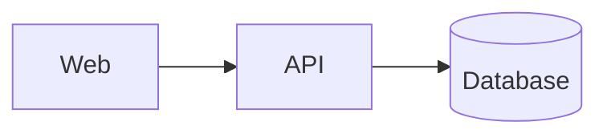
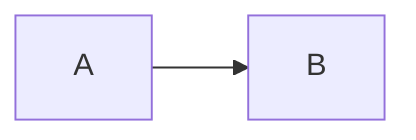

# AI Docs 编写方法

本文用于设计整篇文档。具体图表语法从 `components/index.json` 或对应组件目录继续读取。

## 1. 从读者问题开始

先写出文档要回答的 1-3 个问题，例如：

- 系统由哪些部分组成，它们如何依赖？
- 请求从入口到存储经历哪些步骤？
- 最近六个月指标如何变化？
- 哪些工作已完成、受阻或待决？

每张图应至少回答一个问题。无法说清用途的图通常应删除或换成表格。

## 2. 选择表达形式

| 信息形态 | 推荐形式 |
| --- | --- |
| 单一结论、解释、风险 | 段落或 callout 风格的引用块 |
| 字段、版本、优缺点对比 | Markdown table |
| 命令、配置、代码 | 带语言名的 fenced code block |
| 顺序、分支、交互 | Mermaid |
| 依赖、调用关系和分组拓扑 | Mermaid flowchart |
| 数值趋势、分布、比较 | ECharts |
| 树状主题和提纲 | Markmap |
| 数学定义 | KaTeX |
| 两组对应内容 | 受限 columns |

不要把同一组数据同时做成表格、柱状图和饼图，除非它们分别支持不同结论。

## 3. 推荐文档骨架

```md
# 文档标题

> 一句话摘要，说明结论或用途。

## 背景与范围

说明读者、目标、边界和数据时间。

## 关键结论

- 结论一
- 结论二

## 主体分析

先说明问题，再放图表，随后解释图中最重要的观察。

## 风险与限制

列出不确定性、未覆盖内容和后续动作。
```

标题层级不要跳级。一个章节只有一两句话时，考虑与相邻章节合并。

## 4. 图表前后文

图表前说明“要看什么”，图表后说明“看到了什么”。例如：

```md
下面的依赖图回答部署服务之间的直接调用关系，不包含异步事件。



主要风险是 API 到 DB 的单点依赖；缓存不承担持久化职责。
```

不要只放图而没有解释，也不要在解释中声称图中不存在的信息。

## 5. 尺寸方法

全局默认上限为 960x520。只有出现以下情况时才设置单图尺寸：

- 分栏中的对应图需要视觉一致。
- 复杂图需要更高视口。
- 简单图应限制高度，避免占据整页。

语法：

````md

````

约束：

- 宽度 240-2400 px。
- 高度 160-1600 px。
- 不接受百分比、CSS 或其他属性。
- 同组比较图使用相同 `size`。
- 页面缩放时，图表内容始终等比例增长；视口宽、高分别增长到正文或分栏的可用宽度、屏幕可用高度。某一方向先达到上限时，该方向开始框内滚动，另一方向仍继续增长到自身上限。
- 打印保留当前缩放倍率，并按打印页面的可用宽高应用相同视口规则；较高倍率可能只打印视口内可见区域。

## 6. 分栏方法

分栏适合：

- 左侧结论、右侧代码。
- 两种方案对比。
- 两组尺寸一致的图表。
- 四个简短指标卡式内容。

不适合：

- 长段落或长代码，窄列会降低可读性。
- 需要按顺序阅读的复杂流程。
- 超过四列的密集表格。

完整语法见 `components/layouts/columns.md`。

## 7. 代码与配置

- fence 标注真实语言，不确定时用 `text`。
- 配置示例应保持可解析，敏感值使用环境变量占位符。
- 只展示支持结论所需片段；完整文件可放附录。
- 代码块默认展开并始终提供手动收起/展开按钮；开启 `codeCollapse` 适合让代码较多的报告初始收起，打印时仍会自动展开。

## 8. 数据图原则

- 标题写清指标和时间范围。
- 轴、单位、分类名和图例必须可解释。
- 不使用截断坐标轴夸大差异，除非明确说明。
- 饼图类别通常控制在 5-7 个，过多时改用排序条形图。
- 没有可信数据时不要虚构数字，可改为关系图或待填表格。

## 9. 可读性检查

- 标题是否能单独形成清晰目录。
- 图表颜色是否在亮/暗主题都可区分。
- 节点标签是否短而明确。
- 代码和表格是否超出列宽。
- 图表是否有重复、孤立节点或缺少单位。
- 打印时是否需要保留分栏，或改成顺序内容更合适。
