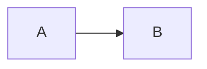

# 受限分栏

## 两列模板

```md
::: columns
::: column
### 方案 A

左列内容。
:::
::: column
### 方案 B

右列内容。
:::
:::
```

## 规则

- 每个 `columns` 必须包含 2-4 个完整 `column`。
- 列内可放普通 Markdown、代码和所有图表。
- 不接受 class、style、宽度比例或其他属性。
- 无效指令会按普通 Markdown 保留，不会自动猜测修复。
- 移动端自动堆叠为一列；打印使用等宽列并保留分栏。
- 带相同 `size` 的图表使用相同等比视口；列宽受挤压时整个视口和图表内容按声明比例同步缩小，不会由 SVG 固有宽度撑开列。
- 窄列中的图表操作栏保持固定结构，按钮不足以完整显示时横向滚动，不挤压图表视口。

## 对应图表尺寸

同一比较行中的图表使用相同 `size`：

````md
::: columns
::: column

:::
::: column
```echarts size=640x360
{"xAxis":{"type":"category","data":["A","B"]},"yAxis":{"type":"value"},"series":[{"type":"bar","data":[1,2]}]}
```
:::
:::
````

长代码、宽表格和节点密集图不适合窄列。必要时改为上下排列。
