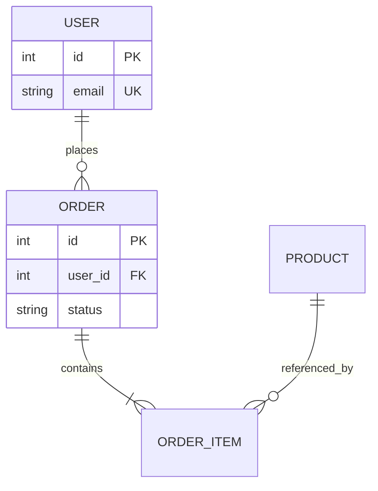

# Mermaid ER Diagram

用于说明实体、关键字段和关系基数。它适合概念或逻辑模型，不应伪装成完整数据库迁移。

## 模板

````md

```mermaid
erDiagram
  USER ||--o{ ORDER : places
  ORDER ||--|{ ORDER_ITEM : contains
  PRODUCT ||--o{ ORDER_ITEM : referenced_by

  USER {
    int id PK
    string email UK
  }
  ORDER {
    int id PK
    int user_id FK
    string status
  }
```
````

## 基数速查

- `||`：恰好一个。
- `o|`：零或一个。
- `|{`：一个或多个。
- `o{`：零或多个。

只展示支持讨论的字段。索引、默认值、约束表达式和迁移细节放在表格或 SQL 代码块中。
