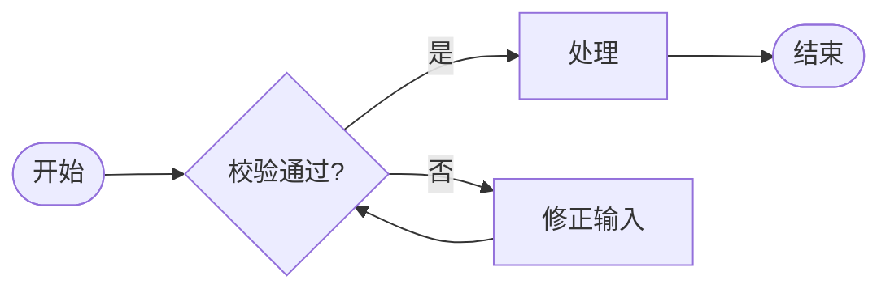
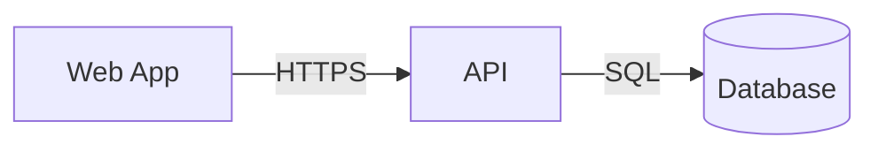
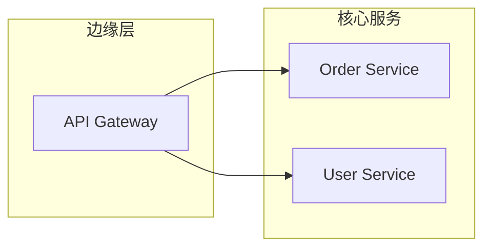

# Mermaid Flowchart

用于业务流程、审批分支、处理链路、数据流、服务依赖、调用关系和分组拓扑。横向调用链优先 `LR`，层级和部署关系优先 `TB` 或 `TD`。

## 基本模板

````md

````

## 节点形状

- `A[步骤]`：普通处理。
- `B{条件?}`：分支判断。
- `C([开始/结束])`：终止点。
- `D[(存储)]`：数据存储。

## 编写方法

1. 先列出开始、结束和 3-8 个核心步骤。
2. 再加入会改变路径的判断，不为每个字段校验都画节点。
3. 给分支边写明确条件，例如 `|成功|`、`|超时|`。
4. 避免交叉边；交叉过多时拆为子流程。

## 依赖与调用关系

````md

````

在正文中明确边方向，例如“`A --> B` 表示 A 在运行时调用 B”。节点 ID 保持 ASCII 且稳定，显示文字放在方括号中。

## 分组拓扑

````md

````

`subgraph` 只用于真实边界，例如网络区、团队或部署单元。节点和交叉边过多时，应按读者问题拆成多张关系图，而不是在一张图中堆满所有依赖。

## 常见问题

- 标签中包含特殊标点导致解析失败时，用引号包住文本。
- 架构依赖应明确边语义；复杂多对多关系优先拆图或改用表格，不要追求单图覆盖全部系统。
- 不在节点标签中放长段 Markdown 或 HTML。
