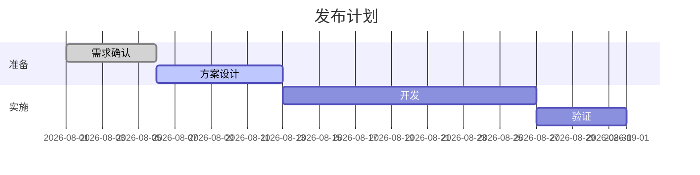

# Mermaid Gantt

用于有明确日期或相对依赖的项目计划。没有可信日期时不要编造工期，可改成流程或阶段表。

## 模板

````md

````

## 编写方法

- `dateFormat` 与实际日期格式保持一致。
- 使用稳定的任务 ID，依赖写 `after <id>`。
- `done`、`active` 只反映已有状态。
- 阶段超过 4-6 个或任务过细时，拆成总览和详细计划。

甘特图用于沟通计划，不替代项目管理系统中的责任人、工时和变更历史。
