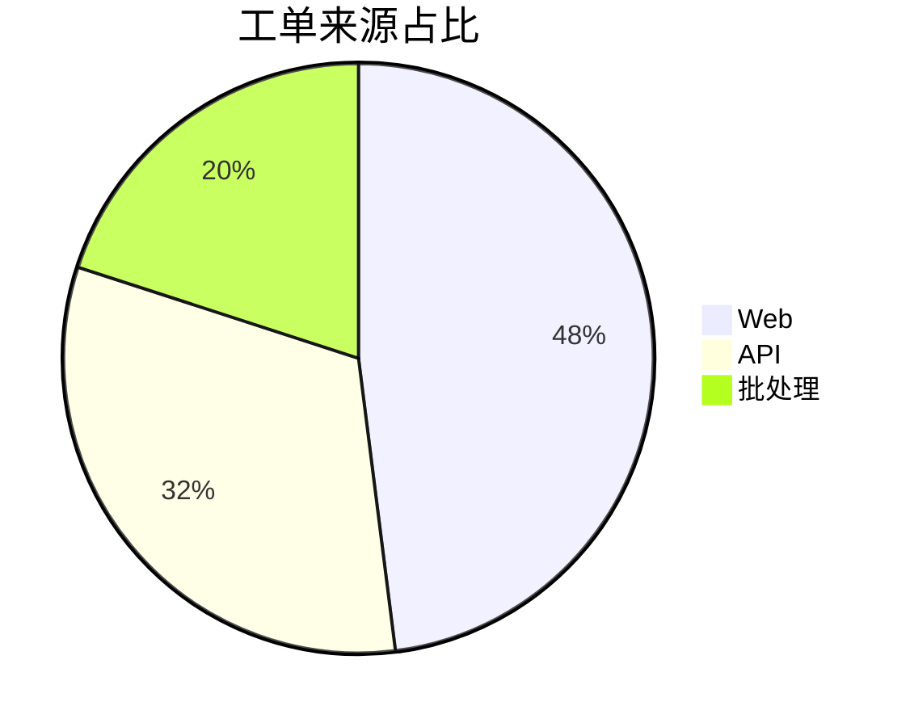

# Mermaid Pie

Mermaid 饼图适合快速展示 5-7 个以内、总和有意义的类别占比。需要精细标签、排序或更多类别时改用 ECharts 条形图/饼图。

## 模板

````md

````

## 检查

- 数值必须来自可核对数据。
- 类别互斥且总体定义一致。
- 标题写清时间范围或总体，例如“2026 Q2 工单来源占比”。
- 类别过多、差异较小时使用排序条形图，避免扇区难比较。
