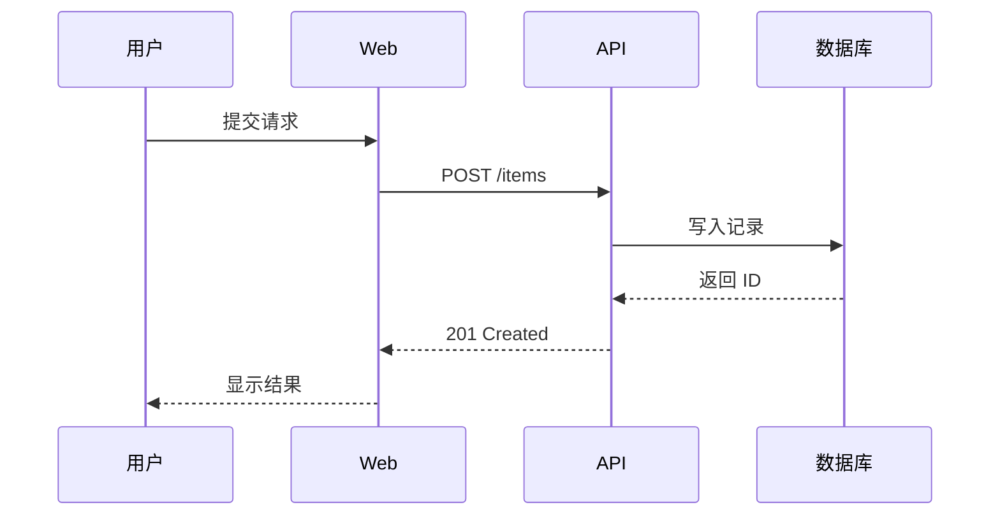
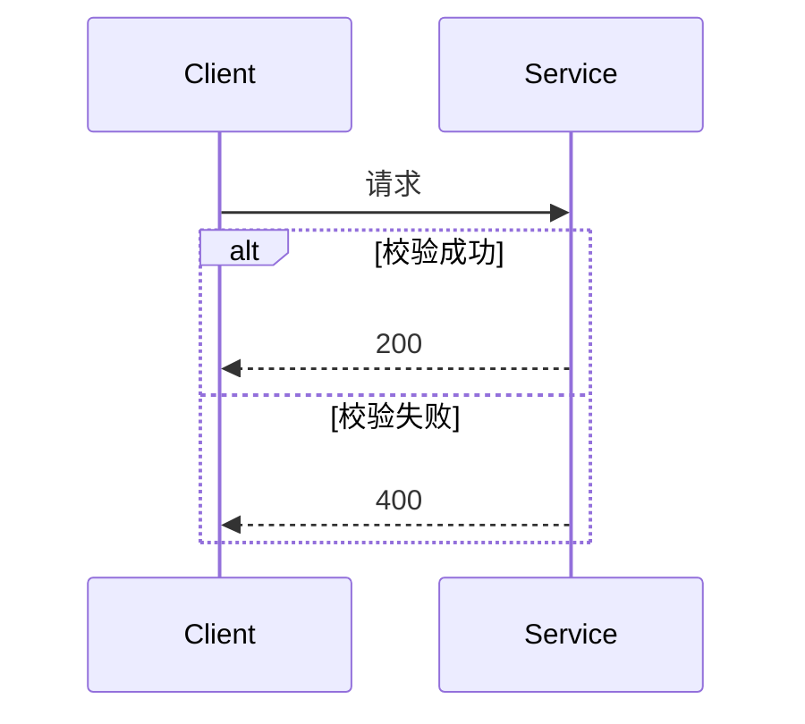

# Mermaid Sequence Diagram

用于接口调用、认证握手、同步/异步消息和失败重试。横轴是参与者，纵轴是时间顺序。

## 模板

````md

````

## 箭头语义

- `->>`：调用或消息。
- `-->>`：返回或响应。
- `-)`：异步消息，可在确认 Mermaid 版本支持后使用。

## 可选结构

````md

````

只保留理解交互必需的消息。内部函数调用过多时，合并成一个有业务意义的步骤。
