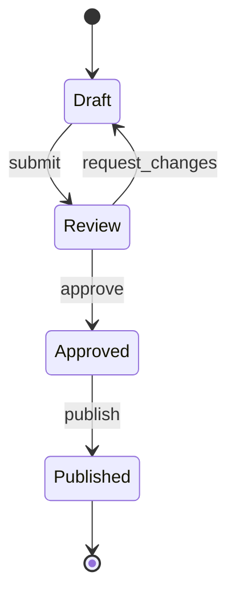

# Mermaid State Diagram

用于订单、任务、审批、连接等对象的生命周期。节点表示状态，边标签表示触发条件或事件。

## 模板

````md

````

## 编写方法

- 状态使用稳定名词，事件使用动词。
- 每个终止状态是否允许重新进入流程要明确。
- 把权限、前置条件或副作用写在图后表格，不把整段规则塞进边标签。
- 如果重点是参与者消息而非状态，改用时序图。
